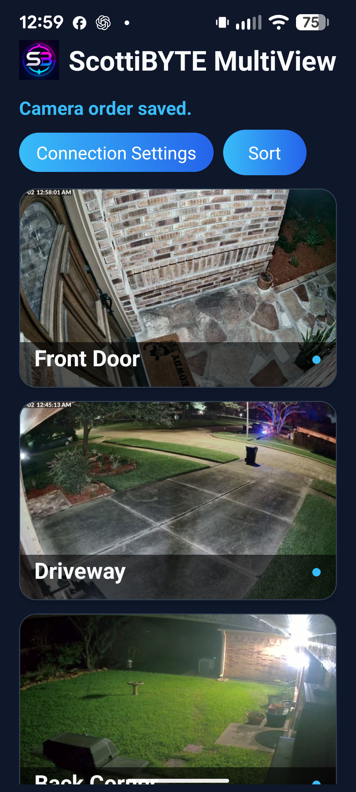

# ScottiBYTE MultiView Mobile

Phone and tablet Android client for **ScottiBYTE MultiView Server**.

## Latest Release

**v0.5.0**

Download the latest APK from the **GitHub Releases** page.

---

## Features

- Mobile-optimized camera browser
- Inline live camera preview
- Full-screen landscape player
- Smooth pinch-to-zoom and panning
- Double-tap zoom reset
- Swipe left and right between cameras
- Drag-and-drop camera ordering
- Secure ScottiBYTE pairing
- Automatic camera thumbnail loading
- Automatic recovery after device sleep
- Optimized for phones and tablets
- ScottiBYTE branded interface

---

## Requirements

Requires **ScottiBYTE MultiView Server**.

Server Repository:

https://github.com/ScottiBYTE/scottibyte-multiview-server

---

## Works With

- ScottiBYTE MultiView Server **v1.2.0 or later**
- Android **10+**
- Android phones
- Android tablets

---

## Pairing

1. Install the APK.
2. Launch the application.
3. Enter your MultiView Server URL.
4. Enter the pairing code shown by the mobile app into the MultiView Server web interface.
5. Approve the client.
6. Cameras automatically load after authorization.

---

## Camera Controls

### Camera Browser

- Scroll through camera thumbnails
- Drag-and-drop camera ordering
- One-touch inline live preview

### Live Preview

- Tap a thumbnail to begin a live preview.
- Tap the live preview again to open the full-screen player.
- Only one inline preview runs at a time for optimal performance.

### Full-Screen Player

- Pinch to zoom
- Drag to pan while zoomed
- Double-tap to reset zoom
- Swipe left/right between cameras
- Immersive landscape viewing

---

## Downloads

The latest APK is available under **GitHub Releases**.

---

## Related Projects

### ScottiBYTE MultiView

- ScottiBYTE MultiView Server
- ScottiBYTE MultiView Android TV
- ScottiBYTE MultiView Mobile

### ScottiBYTE Infrastructure

- ScottiBYTE UniFi Topology
- ScottiBYTE Blast Radius
- ScottiBYTE Incus Backup
- ScottiBYTE Incus Mobile Server

---

Thank you for supporting ScottiBYTE projects!
